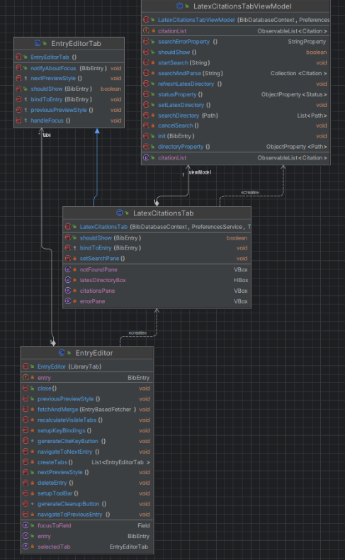
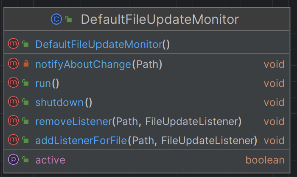
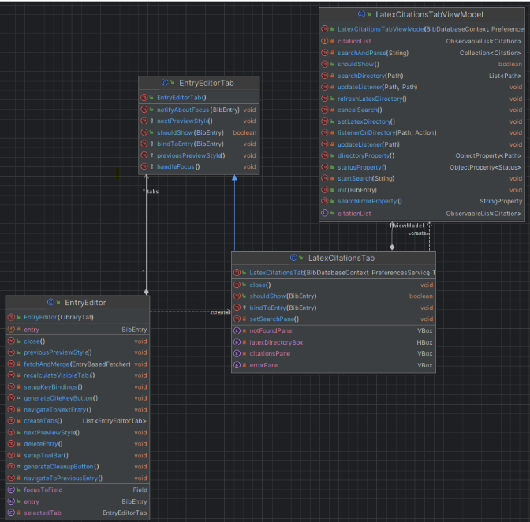
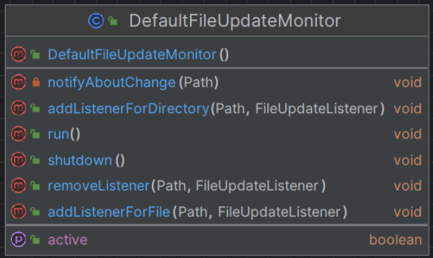

# Report for assignment 4

## Project

Name: JabRef

URL: https://github.com/JabRef/jabref, our fork : https://github.com/rachedkko/jabref/tree/main

JabRef is an open-source, cross-platform citation and reference management tool.
JabRef helps you to collect and organize sources, find the paper you need and discover the latest research.

## Onboarding experience

Choosing a project was a time-consuming task for us. First, we wanted to keep the project we worked on 
for assignment 3 (Scrapy), however we found that the issues seemed to difficult for us 
to resolve. Helped by the following list of open-source projects : https://github.com/MunGell/awesome-for-beginners. 

We had to search for a few hours to find a project with a reactive community, opened
to assign issues to beginners, and with good documentation. We finally found JabRef which met
all of our criteria.

The onboarding experience in JabRef itself was really good. The documentation to setup your IDE and environment to
start developing was really detailed and worked flawlessly. The maintainers are responsive to your questions and
will try to lead the issue solving in the right direction if you make a draft pull request.

## Effort spent

For each team member, how much time was spent in

| /                                        | Roxanne | Alexander | Rached  | Iley    | Marcus   |
|------------------------------------------|---------|-----------|---------|---------|----------|
| 1. plenary discussions/meetings          | 3h      | 3h        | 3h      | 3h      | 3h       |
| 2. discussions within parts of the group | 1h      | 0.5h      | 0.5h    | 0.5h    | 0.5h     |
| 3. reading documentation                 | 3h      | 1h        | 4.5h    | 3.5h    | 3h       |
| 4. configuration and setup               | 0.5h    | 0.5h      | 0.5h    | 2h      | 1h       |
| 5. analyzing code/output                 | 2h      | 5h        | 3h      | 3.5h    | 3h       |
| 6. writing documentation                 | 0h      | 0.5h      | 0.5h    | 0.25h   | 0.25h    |
| 7. writing code                          | 8h      | 8h        | 7h      | 3.5h    | 6h       |
| 8. running code                          | 1.5h    | 1h        | 1h      | 1.5h    | 1h       |
| 9. Writing the report                    | 3h      | 1h        | 0.5h    | 3h      | 2.5h     |
| **Total**                                | **22h** | **20.5h** |**20.5h**| **20.75h** | **20.25h** |

For setting up tools and libraries (step 4), enumerate all dependencies you took care of and where you spent your time, if that time exceeds 30 minutes.

**Iley:** The configuration setup took longer than 30 minutes for me primarly because of differnces in versions and having to reinstall and find what issues were causing problems. There were also problems with the IDE they recommended using since I had never used it before and had to do several changes that were not directly obvious from the setup tutorial they had on the setup guide. I wrote 2 hours spent becasue of this since this is the working time i spent on it (not counting the download time or anything like that).   

## Overview of issue(s) and work done.

Title: Add FileMonitor for LaTeX citations

URL: https://github.com/JabRef/jabref/issues/10585 

Once you've created a library, you may click on one of your source. You can find a LaTeX citation tab, 
it will ask you to select one of your directories and will search in this directory whether there is 
one (or many) LaTeX file(s) citing the specific selected source. The issue is that if a file changes in this 
directory or if a file is created or deleted, the LaTeX file(s) shown to the user are not automatically 
reloaded. Our goal was to trigger a new search for LaTeX file(s) citing the source each time a change in the 
directory occurs.

The scope of this issue is not huge, it affects only the "LaTeX citation" tab. In the code, the main file we had to
look at was `src/main/java/org/jabref/gui/entryeditor/LatexCitationsTabViewModel.java` which is the model for this 
tab and contains all the logic about it, and
`src/main/java/org/jabref/gui/util/DefaultFileUpdateMonitor.java` which is a class implementing FileUpdateMonitor. 
The monitor of our directory was an instance of this DefaultFileUpdateMonitor class, and we had to alter the class a bit.  

## Requirements for the new feature or requirements affected by functionality being refactored

Feature: Add FileMonitor for LaTeX citations

Initial Requirement (From Issue Specification):

- Add FileMonitor to LaTeX Citation functionality **(MAINREQ)**

  - The main goal of solving the issue is to add file monitoring functionality to the LaTeX Citations tab so that 
    whenever a file within the tracked directory is changed, the tab is refreshed so that the user does not
    have to manually refresh the tab whenever a change is made

- Use DefaultFileUpdateMonitor **(USEDEFAULT)**

  - The maintainers wants us to use their DefaultFileUpdateMonitor class instead of
    using the API directly from WatchService or other libraries that can solve this issue

- Have proper Shutdown at the end **(SHUTDOWN)**

  - Since the functionality opens listeners to files to track changes and trigger a refresh event,
    these should be properly shut down whenever the user closes the tab where LaTeX Citation tab is accessible from
    and when the program is shutdown itself

Further Requirements (From Development and Reviews)

- Add Listener to Files not Directory **(COLLECTFILES)**

  - The solution design should add a listener to all .tex files individually and not listen to a full directory

- Modify LatexParser **(LATEXPARSER)**

  - Upon further inquiry, the maintainers intended that one part of the solution was to modify the LatexParser as to
    keep track of the citation keys and their .tex files

- LatexParser Tests **(LATEXPARSERTESTS)**

  - Along with modifications to LatexParser should come their tests
 
- LatexCitationTabViewModel and LatexParserResult Refactoring, and New File Watcher **(ENERGYSAVING)**

  - From our current progress, additional refactoring and implementation of a new file watcher was requested in order to improve on our current implementation, such that it will reduce computational time and energy costs when running the project. 

## Code changes

### Patch

To see our changes you may go to the branch `latexcitation-filemonitor-issue-10585` and run the command `git diff d81192369eb499421c04588e4e0cb0993215607c`
which corresponds to the last commit before any of our changes. 

#### More details 
###### Alexander 
Spearheaded the issue by creating a prototype solution and opening the dialogue with the maintainers (clients) to elicit requirements
and direction for the solution. Using the prototype solution, subtasks were able to be discovered which eased the distribution
of tasks and quirks that need to be fixed or taken into consideration in further development. 

###### Roxanne 
I worked on the fact that the monitor wasn't working recursively on the monitor, therefore I wrote the function 
`listenerOnDirectory` in `LatexCitationsTabViewModel.java`. Then I worked on the fact that our first trials, if we changed
directories and a change happened in an old directory, reload was triggered. That was because we called `.removeListener` was called 
with a `FileUpdateListener` that didn't match the one in `.addListenerOnDirector`. Therefore the listener was never removed. 
I created a map to keep track of listeners which made sure that listeners were probably removed. 

###### Marcus (Sung Kit Ko)
As per the requirement of the stakeholder in finalising a complete solution, my main job was refactoring `LatexCitationsTabViewModel.java` by creating a new `CitationFinder` class in the `org.jabref.logic.texparser` package as per the request of the maintainers, then moving the `searchAndParse` and `searchDirectory` methods to the new class and removing redundant imports to help improve performance and prepare for future implementations. I also worked on implementing a test case for `DefaultFileUpdateMonitor.java` according to the stakeholder's suggestions in order to verify whether new files are being added/listened to.

###### Rached 
I worked on adding a proper shutdown, for that I wrote the shutdown method in `LatexCitationsTabViewModel.java` which I called in the method `close` of `LatexCitationsTab.java` that became an override with the change of the  `EntryEditorTab.java`
I also added a method called closeAllTabs in `EntryEditor.java` which allows actions before closing a tab (in this case removing all the listeners).
Finally, this method is called in the method `OnClosed` in  `LibraryTab.java`, so it can remove all the listeners only when the library is closed as suggested in the issue's comment.

###### Iley 
I worked on fixing a couple of issues the reviewers we had on our issue noticed. The first ones were simple refactorings where error messages and method names had to be changed. After this I changed where the listener started, for this, I had to examine how the listener worked and make sure that the changes I made did not cause any unintentional changes to the program. Lastly, I made a change to do so at most one scan job should wait at a time, this was the hardest part even though the final solution was short because I had to understand what was done and also the way it was implemented, which was done in a way I hadn't seen before. 

## Test results

The tests ran on the final version of our code can be found here :
https://github.com/JabRef/jabref/actions/runs/8135513650

## UML class diagram and its description
### Before our changes

### After our changes

### Description of UML Diagrams
To understand the UML diagrams better here is a short explanation of the different parts found in the diagrams:
**A blue circle** with a “c” is a class.

**A red circle with a “m”** is a method. The parameters to the method are inside the brackets after the name and to the far right of the line is the return type of the method

**A purple circle with a “p”** is a property. The datatype of the property is to the far right of the row.

**An orange circle with a “f”** is a field. The datatype of the field is to the far right of the row.  

**An arrow starting with a diamond** is a aggregation

**A blue solid arrow ending with a normal arrow triangle** is a inheritance

**A dotted line with a arrow at the end without the bottom of the arrows triangle being filled in** is a dependency

**A green padlock** means something is public

**A red padlock means** something is private

**A gray dot instead of a padlock** means it is package-private (the default when not set to anything else)

### Visisble Changes in the UML Diagrams
**The LatexCitationsTabViewModel** has a three new methods called updateListener, listenerOnDirectory and updateListener.

**The LatexCitationsTab** has a new method called close. 

**The DefaultFileUpdateMonitor** was also changed by adding a new method called "addListenerForDirectory". 

## Overall experience

In this project, we learned how to work in the open-source community and more generally how to work with clients. 
We had to adapt our coding style to the existing one of JabRef. We sometimes had ideas of how to resolve an issue
but that wasn't the way our client wanted us to tackle it. In a nutshell, we learned how to discuss with a client understand their 
needs and wants and bring solutions to them.

Moreover, we learned how to enter an existing project. It was hard at first not to be lost due to the size of JabRef and the number of files, but 
thanks to their great extended documentation and their reactive members this was quite a nice journey.

At the end of this assignment, we evaluated our team as being in the state "Collaborating". Having a single common issue for our team really 
made us work together and made us feel united. We communicated a lot during this assignment since we worked on the same file / functions
we had to code on top of each other, so it was really important to understand what each of us had done. This assignment also 
rebuilt the trust we had in our team since everyone was on time with their tasks. 

## P+

Finally, here are the points we've achieved for P+ : 

#### Point 2 : Updates in the source are put into context with the overall software architecture and discussed, relating them to design patterns and/or refactoring patterns. 

In the case of the point 2 : we will take the example of our shutdown implementation :
We added an empty close method in the `EntryEditorTab.java` which is the parent class of `LatexCitationsTab.java`.
The goal of this is to be able to override this method close in `LatexCitationsTab.java` with the correct implementation.
This is a very common design pattern which is called "Template Method" : it's a behavioral design pattern that defines the skeleton of an algorithm in the superclass but lets subclasses override specific steps of the algorithm without changing its structure.
It is commonly used in java and even more specifically in this project : we found multiples example of it.
Due to the overall software architecture and context, we thought that the Template Method was pertinent design pattern to implement a proper shutdown.

#### Point 4 : Your patch is clean in that it (a) removes but does not comment out obsolete code and (b) does not produce extraneous output that is not required for your task (such as debug output) and (c) does not add unnecessary whitespace changes (such as adding or removing empty lines).
  
To check that our patch is clean, the easiest way to do so is by going in the Action tab of Jabref
and looking for our final commit (https://github.com/JabRef/jabref/actions/runs/8135513650). As you can see, all tests checking for style pass, which means 
that our patch respects the style of JabRef. You may also go on the  `latexcitation-filemonitor-issue-10585` and take a look at the 
latest code on it to check that our patch is clean. 

#### Point 6 : You can argue critically about the benefits, drawbacks, and limitations of your work carried out, in the context of current software engineering practice, such as the SEMAT kernel (covering alphas other than Team/Way of Working).

The alpha we will use to critically analyse our work will be the "Requirements" alpha; we found this alpha to be the most applicable as the point of this project is to help address the issue of our stakeholders, in this case, the maintainers of the codebase. Through this, we can use the satisfaction of our stakeholders to determine our current capabilities. We have determined for the "Requirements" alpha, we are at the "Coherent" stage. 

Our team and the stakeholders (in this case, the maintainers of the codebase) have agreed on what needs to be achieved for this issue to be resolved as we accepted the assignment. The stakeholders have stated beforehand that the issue is "the LaTeX citations are NOT backed by the file monitor." Therefore, it is clear that the rationale is to properly implement a SHUTDOWN method to back up the citations. Our team has agreed with the stakeholders on what we are aiming to accomplish through our involvement, and that the priority for achieving this requirement is not highly urgent, but important and benefits users. 

While our solution is considered acceptable by our stakeholders for us to hand off the project with an initial contribution, there is a multitude of optimization issues that we must address to meet the stakeholder's ever-changing requirements, as our implementations sometimes conflict with our stakeholders' requirements, but those are soon addressed by our team. Therefore, this shows that the rate of change in the agreed requirements is quite high, as our implementations are often met with a new set of requirements due to the need for further optimization or not meeting the stakeholder's standards. We can attribute this to the limitation that first, the time horizon to complete the issue is quite small for this assignment as we have two weeks to complete the issue which is of a larger scope. Second, the mismatch in communication time, our stakeholders have a limited time window every day to contact us, which means we cannot get enough frequent feedback to proceed on each stage of development, resulting in us stalling development in certain parts. The good news is, that our team has managed to get the stakeholders to agree to a set of final requirements that they want to achieve with our implementation so that our solution can be considered to be integrated into the final product.

#### Point 8 : In the context of Jonas Öberg's lecture last week, where do you put the project that you have chosen in an ecosystem of open-source and closed-source software? Is your project (as it is now) something that has replaced or can replace similar proprietary software? Why (not)?

In our case, JabRef is under the MIT License, therefore we consider it a free and open-source Permissive license which allows proprietization for both developers and users with minimal restrictions. Additionally, as it is available on GitHub, the source code is free to be distributed and reused by others. In our case, anyone can freely contribute and utilise the software by simply requesting the maintainers to be assigned to ongoing issues in GitHub's issue tracker, allowing for active collaboration between a multitude of developers easily, and therefore it is considered a free and open-source software (FOSS), a complete contrast to proprietary software as it also satisfies the Four Essential Freedoms (from Wikipedia - https://en.wikipedia.org/wiki/Free_and_open-source_software); 1. The freedom to run the program as you wish for any purpose (freedom 0) 2. The freedom to study how the program works, and change it so it does your computing as you wish (freedom 1). Access to the source code is a precondition for this. 3. The freedom to redistribute copies so you can help others (freedom 2). 4. The freedom to distribute copies of your modified versions to others (freedom 3). By doing this you can give the whole community a chance to benefit from your changes. Access to the source code is a precondition for this 

In JabRef's case, it is capable of replacing several proprietary software due to being free to use for users. Simply install the software and anyone can use it without incurring any monetary fees while still retaining many of the features that are included in other proprietary/closed-source software. Therefore, the project is a suitable free alternative for citation management and is considered a superior software to several similar proprietary software. However, due to it being open-source software, there exists a multitude of issues (currently, there are 400+ ongoing issues) in the software that are not being completely addressed quick enough. Some issues persist for a long while and negatively affect user experience, and that is where well-maintained existing proprietary and alternative open-source software with a larger community comes in. The former means that quality is more assured as well as security, while the latter like Zotero with a larger community involvement means issues are usually addressed and more features are outputted at a faster rate. JabRef is still slightly rough around the edges, and in general, it can replace several proprietary software but there do exist superior paid/free alternatives.  
